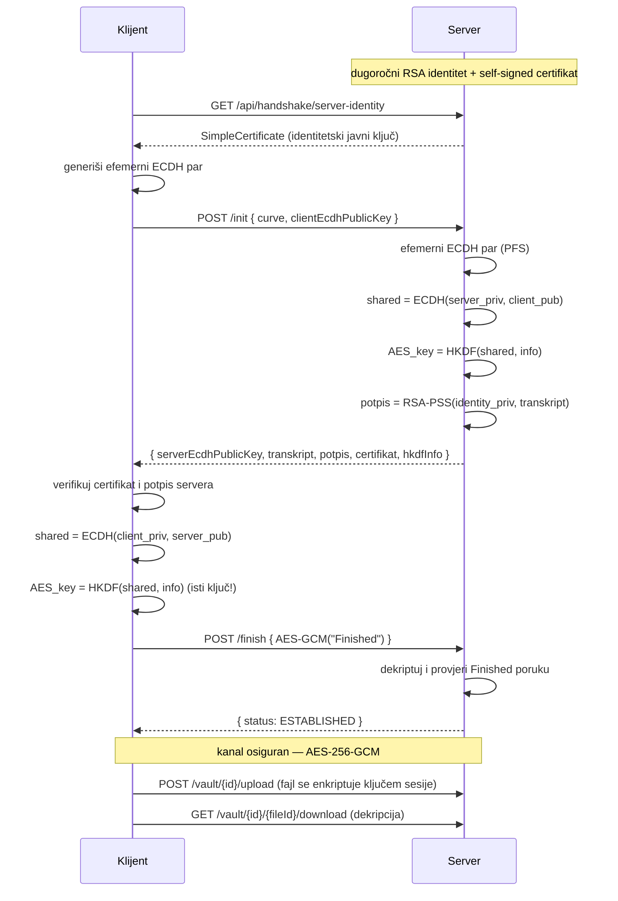

# SecureVault

**Hibridni kriptosistem sa empirijskom komparativnom analizom algoritama.**
Praktični dio završnog rada *„Enkripcijski algoritmi”*.

SecureVault je Spring Boot aplikacija koja kombinuje dvije stvari:

1. **End-to-end sigurnu komunikaciju** — pojednostavljeni TLS-like handshake (ECDH +
   digitalni potpis + HKDF) nakon kojeg se fajlovi čuvaju enkriptovani ključem sesije.
2. **Empirijski benchmark modul** — mjeri i poredi performanse DES / 3DES / AES i
   RSA / DH / ECDH sa realnim brojevima, spremnim za grafove u radu.

Uz to, sadrži **ručnu (edukativnu) implementaciju DES-a** (Feistelova mreža + S-boxovi)
i **kontrolisanu demonstraciju brute-force napada** na skraćeni DES ključ.

---

## Sadržaj

- [Arhitektura](#arhitektura)
- [Tok hibridne sesije (handshake)](#tok-hibridne-sesije-handshake)
- [Pokretanje](#pokretanje)
- [Pregled API-ja](#pregled-api-ja)
- [Primjeri poziva](#primjeri-poziva)
- [Benchmark i grafovi](#benchmark-i-grafovi)
- [Sigurnosne napomene](#sigurnosne-napomene)
- [Testovi](#testovi)
- [Mapiranje na strukturu rada](#mapiranje-na-strukturu-rada)

---

## Arhitektura

```
com.husovic.securevault
├── crypto/
│   ├── symmetric/   AES-GCM, DES, 3DES (JCE) + ManualDes (ručni Feistel)
│   ├── asymmetric/  RSA-OAEP, klasični DH (RFC 3526), ECDH (X25519 / P-256)
│   ├── signature/   RSA-PSS, ECDSA, SimpleCertificate
│   └── kdf/         HKDF (HMAC-SHA256)
├── session/         ServerIdentity, handshake, upravljanje sesijama (PFS)
├── vault/           upload/download fajlova enkriptovanih ključem sesije
├── benchmark/       mjerenje performansi + CSV/JSON izvoz
├── vuln/            edukativna demonstracija brute-force napada
└── config/          Bouncy Castle registracija, OpenAPI/Swagger
```

Kripto jezgro (`crypto/`) je čista, testirana logika bez ovisnosti o web sloju —
koriste ga i handshake i benchmark modul kroz zajednički interfejs
`SymmetricCipherService`.

Tajni materijal (izvedeni AES ključ, efemerni privatni ključevi) **nikada** ne
napušta memoriju procesa: baza (H2) čuva samo javne parametre i metapodatke.

---

## Tok hibridne sesije (handshake)



**Perfect Forward Secrecy:** ECDH par je *efemeran* (nov po svakoj sesiji). Čak i
ako se dugoročni identitetski ključ servera kasnije kompromituje, ranije snimljene
sesije ostaju tajne — jer efemerni privatni ključevi više ne postoje.

---

## Struktura: backend + frontend

Projekt je podijeljen na dva dijela:

```
securevault/
├── src/            BACKEND  — Spring Boot REST API (Java 17)
├── frontend/       FRONTEND — Angular 19 SPA (TypeScript), zaseban npm projekt
└── scripts/        Python klijent + skripte za grafove
```

Frontend priča sa backendom preko istih `/api/...` REST ruta. U razvoju rade dva
servera (backend :8080, Angular dev-server :4200 sa proxy-jem); za predaju se
Angular build ubaci u `src/main/resources/static/` pa server servira i UI i API.

## Pokretanje — BACKEND

Zahtjevi: **JDK 17+** (testirano na JDK 24) i priloženi Maven wrapper.

```bash
./mvnw spring-boot:run
```

Zatim:

- **Swagger UI:** http://localhost:8080/swagger-ui.html
- **OpenAPI JSON:** http://localhost:8080/v3/api-docs
- **H2 konzola:** http://localhost:8080/h2-console
  (JDBC URL: `jdbc:h2:mem:securevault`, korisnik `sa`, bez lozinke)

Šifrati fajlova se čuvaju u `vault-storage/` (konfigurabilno preko
`securevault.storage-dir`).

## Pokretanje — FRONTEND (Angular)

Zahtjevi: **Node 20+** (testirano na v24). Prvo pokreni backend, pa:

```bash
cd frontend
npm install
npm start
```

Otvori **http://localhost:4200** — dev-server automatski proksira `/api` na
backend (`:8080`), pa nema CORS problema. Kompletan handshake (ECDH + HKDF +
AES-GCM + verifikacija potpisa) izvršava se u browseru preko **Web Crypto API-ja**.

Za produkciju (UI unutar jar-a, sve na `:8080`):

```bash
cd frontend
npm run build          # izlaz ide u ../src/main/resources/static/
cd ..
./mvnw spring-boot:run # http://localhost:8080/ sada prikazuje Angular UI
```

---

## Pregled API-ja

| Metoda | Putanja | Opis |
|--------|---------|------|
| `GET`  | `/api/handshake/server-identity` | Certifikat i identitetski ključ servera |
| `POST` | `/api/handshake/init` | Korak 1 — razmjena efemernih ECDH ključeva |
| `POST` | `/api/handshake/finish` | Korak 2 — uspostava sesije (Finished poruka) |
| `POST` | `/api/vault/{sessionId}/upload` | Otprema fajla (enkripcija ključem sesije) |
| `GET`  | `/api/vault/{sessionId}/{fileId}/download` | Preuzimanje i dekripcija |
| `GET`  | `/api/vault/{sessionId}/files` | Lista fajlova sesije |
| `GET`  | `/api/benchmark/symmetric` | Benchmark DES/3DES/AES |
| `GET`  | `/api/benchmark/asymmetric` | Benchmark RSA/DH/ECDH |
| `GET`  | `/api/benchmark/export?format=csv\|json` | Izvoz rezultata |
| `GET`  | `/api/benchmark/results` | Svi akumulirani rezultati |
| `GET`  | `/api/vuln/des-bruteforce` | Brute-force na skraćenom DES ključu |
| `GET`  | `/api/vuln/des-bruteforce/scaling` | Kriva vrijeme-vs-bitovi |

---

## Primjeri poziva

Benchmark (radi bez sesije):

```bash
# AES-256 na 1 MB podataka, 20 ponavljanja
curl "http://localhost:8080/api/benchmark/symmetric?algorithm=AES&keySize=256&dataSizeKB=1024&repetitions=20"

# 3DES na istoj veličini (za poređenje brzine)
curl "http://localhost:8080/api/benchmark/symmetric?algorithm=3DES&dataSizeKB=1024&repetitions=20"

# RSA-2048: keygen + enc/dec male poruke
curl "http://localhost:8080/api/benchmark/asymmetric?algorithm=RSA&keySize=2048&repetitions=10"

# ECDH nad Curve25519: keygen + razmjena
curl "http://localhost:8080/api/benchmark/asymmetric?algorithm=ECDH&keySize=X25519&repetitions=50"

# Brute-force skaliranje (za graf eksponencijalnog rasta)
curl "http://localhost:8080/api/vuln/des-bruteforce/scaling?minBits=8&maxBits=24"

# Izvoz svih rezultata u CSV
curl "http://localhost:8080/api/benchmark/export?format=csv" -o benchmark.csv
```

Kompletan handshake zahtijeva kripto na strani klijenta (ECDH + HKDF + AES-GCM).
Gotov klijent je u [`scripts/securevault_client.py`](scripts/securevault_client.py).

---

## Benchmark i grafovi

1. Pokreni mjerenja (Swagger ili `curl`), pa izvezi:
   ```bash
   curl "http://localhost:8080/api/benchmark/export?format=csv" -o benchmark.csv
   ```
2. Nacrtaj grafove (van Spring Boot projekta):
   ```bash
   pip install -r scripts/requirements.txt
   python scripts/plot_benchmarks.py benchmark.csv
   ```
   Skripta pravi: propusnost vs. veličina podataka (log skala) i vrijeme keygen-a
   vs. dužina ključa — spremno kao *Slika X* u poglavlju 3.5.

> **Metodološka napomena (za rad):** obavezno zabilježi hardversku konfiguraciju
> na kojoj su mjerenja rađena (CPU, RAM, JVM verzija) — akademski standard za
> reproducibilnost.

---

## Sigurnosne napomene

- Nijedan privatni ključ, lozinka ni tajni parametar **nije hardkodiran** u repo.
- Identitetski RSA par servera se generiše u memoriji pri pokretanju.
- Izvedeni AES ključevi sesija žive samo u memoriji (`SessionKeyStore`) i brišu se
  po isteku/zatvaranju sesije.
- `vuln/` modul je **strogo edukativan** i radi isključivo nad ključevima koje
  aplikacija sama generiše u kontrolisanom okruženju — nije alat za napad.
- Za produkciju bi trebalo dodati: TLS na transportu, rate-limiting, i zamjenu H2
  perzistentnom bazom (vidi Docker napomenu u planu).

---

## Testovi

```bash
./mvnw test
```

Pokriveno (30 testova):

- round-trip i „tuđi ključ ne dekriptuje” za sve simetrične algoritme;
- ručni DES protiv **FIPS test-vektora** i protiv JCE implementacije (blok po blok);
- ECDH/DH dogovor ključa, RSA-OAEP, RSA-PSS, ECDSA, HKDF, certifikati;
- **end-to-end** handshake + vault (i preko servisa i preko HTTP-a / MockMvc);
- benchmark i brute-force logika.

---

## Mapiranje na strukturu rada

| Sekcija rada | Šta prikazuje | Modul |
|--------------|---------------|-------|
| Arhitektura sistema | Dijagram toka handshake → session → vault | `session/`, `vault/` |
| Implementacija hibridnog kriptosistema | ECDH + HKDF + potpis, isječci koda | `crypto/`, `session/` |
| Empirijska komparativna analiza | Grafovi brzine po algoritmu/veličini/ključu | `benchmark/` |
| Sigurnosna analiza (praktična) | Brute-force demo, eksponencijalna kriva | `vuln/` |
| Zaključak praktičnog dijela | Sinteza mjerenja (AES ≫ 3DES, ECDH ≪ RSA keygen) | sve |
